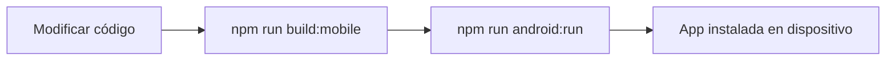

# 📱 JOINIFY MOBILE - GUÍA RÁPIDA

## 🚀 INICIO RÁPIDO (3 pasos)

### 1️⃣ Iniciar el backend
```powershell
cd server
node server_FINAL.js
```

### 2️⃣ Compilar y sincronizar
```powershell
npm run build:mobile
```

### 3️⃣ Ejecutar en Android
```powershell
npm run android:dev
```

---

## 📋 COMANDOS DISPONIBLES

| Comando | Descripción |
|---------|-------------|
| `npm run build:mobile` | Compila Angular + Sincroniza Capacitor |
| `npm run android:dev` | Abre Android Studio |
| `npm run android:run` | Ejecuta directamente en dispositivo/emulador |
| `npm run sync` | Solo sincroniza (sin compilar) |
| `npx cap open android` | Abre Android Studio manualmente |

---

## ⚙️ CONFIGURACIÓN DE URLs

### Para EMULADOR Android:
```typescript
// src/app/app.config.ts
return 'http://10.0.2.2:3001';  // ✅ Ya está configurado
```

### Para DISPOSITIVO FÍSICO:
```typescript
// src/app/app.config.ts
return 'http://TU_IP_LOCAL:3001';  // Ejemplo: 'http://192.168.1.100:3001'
```

**Obtener tu IP local**:
```powershell
ipconfig  # Windows
```
Busca "Dirección IPv4" (ejemplo: 192.168.1.100)

---

## 🐛 PROBLEMAS COMUNES

### ❌ "Cannot connect to server"
- ✅ Verifica que el backend esté corriendo
- ✅ Si usas celular, verifica que esté en la misma WiFi que tu PC
- ✅ Actualiza la IP en `app.config.ts`

### ❌ "Android SDK not found"
- ✅ Instala Android Studio: https://developer.android.com/studio
- ✅ Configura ANDROID_HOME en variables de entorno

---

## 📂 ARCHIVOS IMPORTANTES

```
├── capacitor.config.ts          # Configuración de Capacitor
├── src/app/app.config.ts        # URLs del backend (WEB/MÓVIL)
├── src/main.ts                  # Inicialización de plugins
├── src/mobile-styles.css        # Estilos para móvil
└── android/                     # Proyecto Android nativo
    └── app/src/main/
        ├── AndroidManifest.xml  # Permisos Android
        └── res/xml/network_security_config.xml  # Seguridad HTTP
```

---

## 🎯 FLUJO DE TRABAJO



---

## 📱 PROBAR EN TU CELULAR

1. **Habilita modo desarrollador**:
   - Ajustes → Acerca del teléfono
   - Toca 7 veces "Número de compilación"
   - Activa "Depuración USB"

2. **Conecta con cable USB**

3. **Ejecuta**:
   ```powershell
   npm run android:run
   ```

---

## 🔍 DEBUGGING

### Ver logs en tiempo real:
```powershell
adb logcat | findstr "Capacitor"
```

### Inspeccionar con Chrome DevTools:
1. Abre Chrome
2. Ve a: `chrome://inspect`
3. Click en "Inspect" en tu dispositivo

---

## 📚 MÁS INFORMACIÓN

Lee la **GUIA_MOBILE.md** completa para:
- ✅ Instalación de Android Studio
- ✅ Configuración de variables de entorno
- ✅ Solución detallada de problemas
- ✅ Compilación para producción
- ✅ Personalización (iconos, splash screen, etc.)

---

**¿Necesitas ayuda?** Consulta: https://capacitorjs.com/docs
